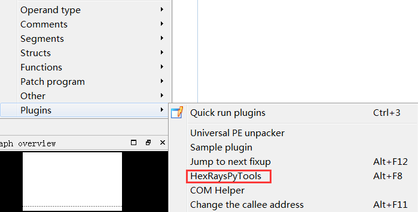

# 0x00 前言

很多CM都是基于各种算法的，很少有基于数据结构的CM。这个Trie树其实是学校考试的时候的一道题，然后那次考试我没考好（逃。。。考完之后我就去搜索了一下关于Trie树的资料，然后觉得这个挺有意思的，就根据这个数据结构写了个CM。。。

# 0x01 Trie树介绍

简单的说，Trie树是做了一个映射，将字符串映射到其对应的频率或者其它值。
> 又称单词查找树，Trie树，是一种树形结构，是一种哈希树的变种。典型应用是用于统计，排序和保存大量的字符串（但不仅限于字符串），所以经常被搜索引擎系统用于文本词频统计。它的优点是：利用字符串的公共前缀来减少查询时间，最大限度地减少无谓的字符串比较，查询效率比哈希树高。——百度百科


比方说，现在有一些单词 kanxue ctf crack me crack，那么，crack会被映射到2，因为它出现过2次，而其它的会被映射到1。
## Trie树的实现

 
——维基百科
如图所示，
trie树的性质：
1. 根节点的字符串是空

2. 其它节点字符串不为空

3. 一个节点的所有子节点的所有字符串，不能有相同前缀：比方说abc和agf就不能在同一个节点下面，因为他们有相同前缀a

4. 从根节点开始，走到任意一个节点，将走过的路径上的所有字符串拼接起来，那个终点节点的数便是拼接起来的字符串的映射到的频率（或者不一定是频率，也可以是某个其它value）。比方说，这张图，就很明显了。romane，就映射到1，ruber，就映射到5。

   

   PS：我这道题实现的方法是，把前缀存在节点，每个节点可以存多个字符，所以查找子节点需要for遍历。根节点为空字符串，跟网上一般的实现有点区别（不然又成开源CM了）

# 0x02 题目

## TrieTree相关逻辑算法

这道题，正确答案是一个如图所示的Trie Tree:
 
```cpp

	char str_c[2];
	char str_k[2];
	char str_7[2];
	char str_M[2];
	char str_f[2];
	char str_9[2];
	char str_kx[3];
	char str_t[2];

	getStr_f(str_f);
	getStr_t(str_t);
	getStr_M(str_M);
	getStr_7(str_7);
	getStr_9(str_9);
	getStr_k(str_k);
	getStr_c(str_c);
	getStr_kx(str_kx);
	//get the string dynamically
	//so that these string will not appear in the .rodata

	node_9.setContent(str_9);
	node_M.setContent(str_M);
	node_k.setContent(str_k);
	node_c.setContent(str_c);
	node_7.setContent(str_7);
	node_t.setContent(str_t);
	node_kx.setContent(str_kx);
	node_f.setContent(str_f);
    //set the content of the Trie Tree Node
        

	node_M.addChild(&node_k);
	node_t.addChild(&node_9);
	node_7.addChild(&node_M);
	node_t.addChild(&node_f);
	node_c.addChild(&node_7);
	node_root.addChild(&node_kx);
	node_c.addChild(&node_t);
	node_root.addChild(&node_c);
    //build the trie tree

	node_c.setNumber(0);
	node_k.setNumber(1);
	node_9.setNumber(1);
	node_t.setNumber(1);
	node_7.setNumber(1);
	node_M.setNumber(2);
	node_root.setNumber(0);
	node_f.setNumber(1);
	node_kx.setNumber(1);
    //set the frequency

	answerTree.setRoot(&node_root);
```
首先判断输入长度和内容，全是字母数字和长度为22的检查，这个不说。

然后，会将输入拆成
xx xx xxx xx xxxx xxx xxx xxx
的形式，一个个地插入到一个空的Trie树中

```cpp
	char c7M[4];
	char c7[3];
	char ctf[4];
	char c7M2[4];
	char c7Mk[5];
	char ct[3];
	char ct9[4];
	char kx[3];

	c7[2] = 0;
	ct[0] = input[2];
	c7M2[3] = 0;
	c7[1] = input[1];
	c7Mk[3] = input[12];
	ct9[0] = input[16];
	c7Mk[0] = input[9];
	kx[0] = input[7];
	c7Mk[1] = input[10];
	kx[1] = input[8];
	c7M[1] = input[5];
	c7Mk[4] = 0;
	ctf[2] = input[15];
	ct[2] = 0;
	kx[2] = 0;
	c7M2[2] = input[6];
	ctf[1] = input[14];
	c7M2[0] = input[4];
	ct[1] = input[3];
	ctf[0] = input[13];
	ct9[3] = 0;
	c7M2[1] = input[20];
	ct9[1] = input[17];
	c7[0] = input[0];
	c7M[2] = input[21];
	ctf[3] = 0;
	c7M[0] = input[19];
	c7Mk[2] = input[11];
	ct9[2] = input[18];
	c7M[3] = 0;
	//seperate the input into serveral sections
	//shuffle the order, so more difficult to reverse
	//I don't use things like substring, that will make it easy to reverse
	RadixTree rt;
	rt.addString(ctf);
	rt.addString(c7);
	rt.addString(c7Mk);
	rt.addString(c7M2);
	rt.addString(ct);
	rt.addString(kx);
	rt.addString(ct9);
	rt.addString(c7M);
    //add the sections into RadixTree
	if (rt == answerTree)
	{//if tree is equal, do the third check
		thirdCheck(c7, kx, ctf, ct9, szCor, szWrong);
	}
	else
	{
		MyMessageBox(szWrong);
	}
```
然后如果这两个树相等，进入下一次检查 
```cpp
if ((c7[0] ^ c7[1]) == ('c'^'7') &&
		(kx[0] ^ kx[1]) == ('x'^'k') &&
		(ctf[2] ^ ctf[1]) == ('f'^'t') &&
		(ct9[1] ^ ct9[2]) == ('t'^'9'))
		MyMessageBox(szCor);
	else
		MyMessageBox(szWrong);
```
因为trie树只统计了频率，并没有统计顺序。这个时候就要判断一下，每个位置上是否是正确的值，为了防止直接的明文出现，这里使用了异或。

## C++类设计

UML图如下
 

其中，带Abs的是抽象基类；Static是静态tree和node，也就是用来装正确答案的；而什么都没加的是用来放置输入的。

`Node`代表节点，而`Tree`的成员变量会存一个`Node`作为根节点

`TrieTreeString`和`TrieTreeChildren`分别用来代替STL的`std::string`和`std::vector`，目的是降低难度（这道题我出出来是想让大家能够做出来的）。
A类唯一作用就是在他的构造函数中初始化好正确答案的Trie，因为全局对象的构造函数会在`main`函数之前被调用。

# 0x03 题目中的提示

其实很明显了，第一点是在`pdb path`中

 

`\x00`截断后，存在提示。当然这个可能发现的人不多。。。

 

这个应该就很明显了，没`RTTI`的类的类名都告诉你了。。。
(可恶的出题人因为觉得放这个提示会太简单，所以此条提示作废)

还有我在一个地方使用了`dynamic_cast`，所以说`RTTI`会被打开，那么其实类名已经告诉你了。。。

 
实际上，使用工具[class_informer](https://www.52pojie.cn/thread-694872-1-1.html)，完全可以获取到上面所说的类的继承关系的信息
 

（如何，在这个充满反调试与虚拟机保护的比赛中，是不是对这种提示感到了一丝温暖

# 0x04 使用HexRaysPyTools逆向C++类

[https://github.com/igogo-x86/HexRaysPyTools](https://github.com/igogo-x86/HexRaysPyTools)

一个挺好用的IDA插件，逆C++的时候用这个特别爽，可以省去很多不必要的工作，而且特别适合解这道题，所以推荐给大家。安装说明在上面的repo中，这里不解释。。。

这里举个例子，比方说，我们想还原类`TrieTreeNode`。首先找到它的构造函数`sub_403100`，然后右键deep scan


这个的意思是，它会根据所有这个变量传达到的函数，根据访问偏移推测出其成员变量，这个工具原理就是这个，大家自行领会。。。

然后`Edit->plugins->HexRaysPyTools`




然后得出的结果会有collision，正常，因为对于同一个偏移可能有不同类型的访问方式，所以我们把一些无关的disable掉（选中按disable按钮），然后逆向发现偏移4处很可能是一个byte array，所以先双击`_DWORD`把类型改成`_BYTE`，再点array按钮。最后点finalize，创建结构体。如图所示。


与源代码对比一下

```c++
//TrieTreeNodeAbs
protected:
	TrieTreeString content;
	TrieTreeChildren<> children;
	int number;
private:
	TrieTreeNodeAbs* findChildGivenContent(const TrieTreeString& str) const;
//TrieTreeString
#define MAX_STRING_LEN 128
	char str[MAX_STRING_LEN];
	size_t length;
//TrieTreeChildren
template<typename Node = TrieTreeNodeAbs, size_t MAX_NUM_CHILD = 32>
//...
private:
	Node* children[MAX_NUM_CHILD];
	size_t num;

#pragma pack(push, 1)
struct TrieTreeNode
{
  Vtable_TrieTreeNode *vtable;
  _BYTE string_and_children[260];
  _DWORD children_num;
  _DWORD number;
};
#pragma pack(pop)
```

发现还是有点偏差，所以这个东西也不可能一键还原C++类，还是需要手工再逆向并且修改的。不过这个自动化识别已经可以帮我们省去很多工作了。

# 0x05 简单的保护

唯一做了保护的地方就是动态生成字符串。毕竟不能把一些很关键的字符串直接放在`.rodata`里的。。。
### 动态生成字符串
```python
import sys
import random

sysArgn = len(sys.argv)

def genCCode(istr):
	three = random.randint(0, 0xFF)
	two   = random.randint(0, 0xFF)
	one   = random.randint(0, 0xFF)
	zero  = random.randint(0, 0xFF)

	cCode = ""
	i = 0
	l = []
	for c in istr:
		l.append(ord(c) ^ ((three*i*i*i + two*i*i + one*i + zero) % 0x100))
		i = i + 1
	cCode = cCode + "void getStr(char* szDesP)\n//pre: the szDes must have size " + str(len(istr) + 1) + "\n{\n\tunsigned char* szDes = (unsigned char*)szDesP;\n";
	i = 0;
	for x in l:
		cCode = cCode + "\tszDes[" + str(i) + "] = " + str(x) + ";\n"
		i = i + 1;
	cCode = cCode + "\tszDes[" + str(i) + "] = 0;\n"

	cCode = cCode + "\tfor (unsigned int i = 0; i < " + str(len(istr)) + "; i++)"
	cCode = cCode + "\n\t{\n\t\tszDes[i] ^= (unsigned char)"
	cCode = cCode + "("+hex(three)+"*i*i*i + "+hex(two)+"*i*i + "+hex(one)+"*i + "+hex(zero)+");\n\t}\n}"
	return cCode;


def main(argn, argv):
	if (argn != 2):
		print("must have 1 argument")
	else:
		print genCCode(argv[1])

main(sysArgn, sys.argv)
```
这段python脚本可以生成一段C语言代码，这段C语言代码可以动态返回一个字符串
```c
//python genDynCstring.py HelloWorld
void getStr(char* szDesP)
//pre: the szDes must have size 11
{
        unsigned char* szDes = (unsigned char*)szDesP;
        szDes[0] = 185;
        szDes[1] = 141;
        szDes[2] = 123;
        szDes[3] = 224;
        szDes[4] = 58;
        szDes[5] = 215;
        szDes[6] = 116;
        szDes[7] = 70;
        szDes[8] = 181;
        szDes[9] = 124;
        szDes[10] = 0;
        for (unsigned int i = 0; i < 10; i++)
        {
                szDes[i] ^= (unsigned char)(0x2d*i*i*i + 0x15*i*i + 0xb5*i + 0xf1);
        }
}//执行完后，szDesP里面的内容会是"HelloWorld"
```
这个其实很简单，动态调试，或者符号执行，都可以把这个分析出来，所以破解方法不详细说了。。。

具体生成的方法说下，随机生成一个三次多项式的系数，再把这个多项式`% 0x100`，记做函数`f`，那么在Python中就是`f(i)^str[i]`作为一开始赋值的常数，其中`str`是原字符串。那么在后面C的还原中，便是`f(i)^str[i]^f(i)`，即`str[i]`。